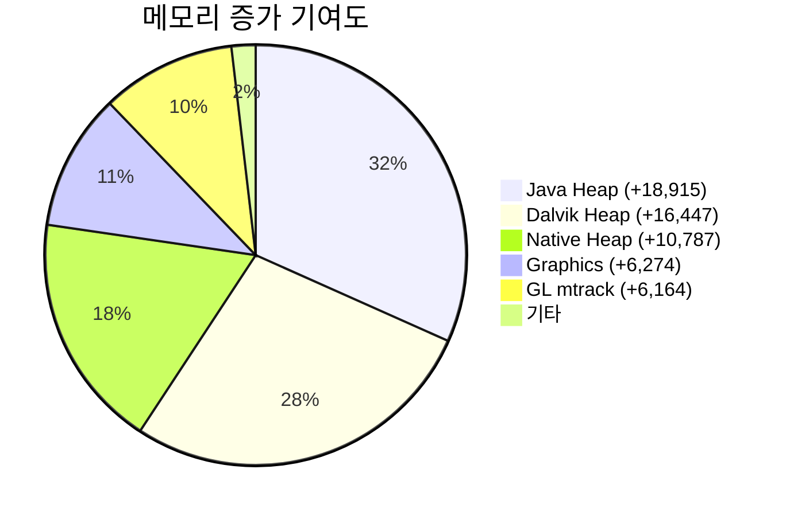
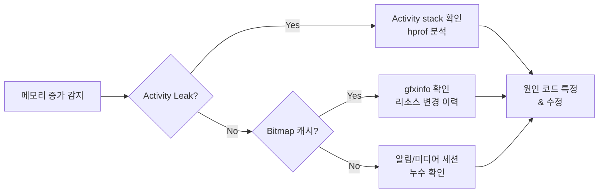

# SystemUI Memory Regression 분석 보고서

**생성일시:** 2026-04-26 14:47:24  
**Baseline:** S948NKSU2AZDD (3회 평균)  
**Regression:** S948NKSU2AZDE (3회 평균)  
**심각도:** :red_circle: Critical

---

## 1. 전체 요약

| 지표 | Baseline | Regression | 변화량 | 변화율 |
|------|----------|------------|--------|--------|
| **Total PSS** | 76,009 KB | 109,700 KB | +33,691 KB | +44.3% |
| **Total RSS** | 95,011 KB | 137,125 KB | +42,114 KB | +44.3% |

```mermaid
xychart-beta
    title "메모리 사용량 비교 (KB)"
    x-axis ["Total PSS", "Total RSS"]
    y-axis "KB" 0 --> 150000
    bar [76009, 95011]
    bar [109700, 137125]
```

---

## 2. 메모리 증가 주요 원인 (Top Contributors)

| 순위 | 영역 | 증가량 (KB) | 증가율 | 심각도 |
|------|------|-------------|--------|--------|
| 1 | Java Heap | +18,915 | +73.5% | :red_circle: Critical |
| 2 | Dalvik Heap | +16,447 | +73.5% | :red_circle: Critical |
| 3 | Native Heap | +10,787 | +70.8% | :red_circle: Critical |
| 4 | Graphics | +6,274 | +30.7% | :yellow_circle: Warning |
| 5 | GL mtrack | +6,164 | +50.4% | :yellow_circle: Warning |

---

## 3. 메모리 섹션별 상세 비교

| 섹션 | Baseline (KB) | Regression (KB) | 변화량 | 심각도 |
|------|---------------|-----------------|--------|--------|
| Native Heap | 15,232 | 26,019 | +10,787 | :red_circle: Critical |
| Dalvik Heap | 22,372 | 38,819 | +16,447 | :red_circle: Critical |
| Dalvik Other | 3,425 | 3,328 | -97 | :green_circle: Info |
| Stack | 610 | 521 | -89 | :green_circle: Info |
| .so mmap | 8,143 | 8,353 | +210 | :green_circle: Info |
| .art mmap | 3,433 | 3,457 | +24 | :green_circle: Info |
| EGL mtrack | 8,211 | 8,320 | +109 | :green_circle: Info |
| GL mtrack | 12,238 | 18,402 | +6,164 | :yellow_circle: Warning |
| Unknown | 2,343 | 2,478 | +135 | :green_circle: Info |

```mermaid
xychart-beta
    title "섹션별 메모리 비교 (KB)"
    x-axis ["Native", "Dalvik", "DalvikOther", "Stack", ".so", ".art", "EGL", "GL", "Unknown"]
    y-axis "KB" 0 --> 42000
    bar [15232, 22372, 3425, 610, 8143, 3433, 8211, 12238, 2343]
    bar [26019, 38819, 3328, 521, 8353, 3457, 8320, 18402, 2478]
```

---

## 4. Objects 변화

| 항목 | Baseline | Regression | 변화량 | 심각도 |
|------|----------|------------|--------|--------|
| Views | 456 | 900 | +444 | :yellow_circle: Warning |
| Activities | 0 | 2 | +2 | :green_circle: Info |
| Local Binders | 225 | 199 | -26 | :green_circle: Info |
| Proxy Binders | 174 | 101 | -73 | :green_circle: Info |

---

## 5. AI 원인 분석

!!! danger "심각도: Critical — 즉시 조치 필요"

    Total PSS가 44.3% 증가하여 Critical 수준입니다.

### 5.1 주요 변화 요약

- **메모리 전체:** 76MB → 110MB (+34MB, +44.3%)
- **가장 큰 증가:** Java Heap (+18.9MB), Dalvik Heap (+16.4MB), Native Heap (+10.8MB)
- **Objects 이상 징후:** Views 456 → 900개 (+97.4%), Activities 0 → 2개

### 5.2 원인 가설

!!! warning "가설 1: Activity Leak (신뢰도: 높음)"

    **근거:**

    - Activities가 0 → 2로 증가 (SystemUI는 일반적으로 Activity를 보유하지 않음)
    - Views가 456 → 900으로 약 2배 증가 (Activity당 View tree가 추가된 것으로 추정)
    - Java Heap과 Dalvik Heap이 동시에 ~73% 증가 (Activity에 바인딩된 객체들)

    **확인 방법:**

    - `dumpsys activity activities` 에서 SystemUI의 Activity stack 확인
    - hprof 덤프 → Activity 인스턴스가 GC되지 않고 남아있는지 확인

!!! note "가설 2: Bitmap/Drawable 캐시 과다 (신뢰도: 중간)"

    **근거:**

    - Native Heap +10.8MB (Bitmap 데이터는 Native 메모리에 할당)
    - GL mtrack +6.2MB (하드웨어 가속 렌더링 버퍼 증가)
    - Graphics 전체 +6.3MB

    **확인 방법:**

    - `dumpsys gfxinfo com.android.systemui`에서 텍스처 캐시 사이즈 확인
    - 새로 추가된 UI 요소(알림 패널, 퀵셋팅 아이콘 등)가 있는지 변경 이력 확인

!!! note "가설 3: 알림 채널 또는 미디어 세션 누수 (신뢰도: 낮음)"

    **근거:**

    - Dalvik Other는 변화 없으나 Java Heap만 큰 폭 증가
    - 알림 관련 객체가 해제되지 않고 누적될 가능성

    **확인 방법:**

    - `dumpsys notification`에서 활성 알림 수 확인
    - `dumpsys media_session`에서 세션 누수 여부 확인

### 5.3 조치 권고 (우선순위순)

| 우선순위 | 조치 | 담당 |
|:---:|---|---|
| **1** | Activity Leak 확인 — `dumpsys activity` 및 hprof 분석 | SystemUI 담당자 |
| **2** | 해당 빌드의 commit diff 확인 — AZDD → AZDE 간 SystemUI 변경사항 | 빌드 담당자 |
| **3** | Bitmap 캐시 정책 확인 — 이미지 리소스 변경 여부 | UI/UX 담당자 |

### 5.4 관련 서브시스템 조사 흐름

---

## 6. 분석자 기록 (Human-in-the-loop)

> 아래 영역은 분석 담당자가 직접 작성합니다.

| 항목 | 내용 |
|---|---|
| **실제 원인** | *(AI 가설 중 맞은 것, 또는 실제 원인 기록)* |
| **원인 코드 변경** | *(문제를 유발한 commit/CL 정보)* |
| **해결 조치** | *(어떻게 수정했는지)* |
| **추가 확인 데이터** | *(hprof, systrace 등 뭘 더 봤는지)* |
| **카테고리 태그** | *(예: View Leak, Bitmap Cache, Activity Leak 등)* |

---

*이 보고서는 SystemUI Analyzer에 의해 자동 생성되었습니다.*  
*AI 분석: Claude (시뮬레이션) | 분석 소요: 0.8초*
