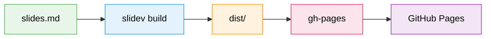
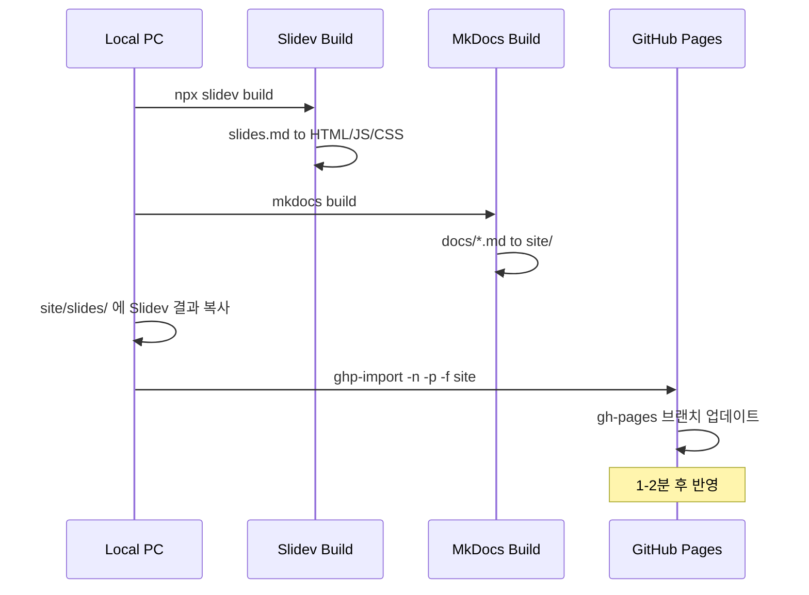

# Slidev to GitHub Pages

마크다운으로 만드는 프레젠테이션, 그리고 무료 배포

<div class="absolute bottom-10 text-sm opacity-50">
  2026.04 | Powered by Slidev
</div>

---
layout: intro-image-right
image: https://images.unsplash.com/photo-1516321318423-f06f85e504b3?w=800
---

# 이 슬라이드는?

<div class="leading-8 mt-4">

이 프레젠테이션 자체가<br>
**Slidev로 만들어져서**<br>
**GitHub Pages에 배포된** 결과물입니다.

</div>

<div class="mt-8 text-sm opacity-70">
어떻게 만들었는지, 지금부터 알려드립니다.
</div>

---
layout: section
---

# Part 1
## Slidev란?

---

# Slidev 소개

개발자를 위한 프레젠테이션 도구

<div class="grid grid-cols-2 gap-8 pt-4">
<div>

### 특징

- **마크다운 기반** - 코드 에디터에서 작성
- **코드 하이라이팅** - 개발자 발표에 최적
- **Vue 컴포넌트** - 인터랙티브한 슬라이드
- **다이어그램 지원** - Mermaid 내장
- **수식 지원** - KaTeX 내장
- **다크/라이트 모드** - 자유롭게 전환

</div>
<div>

### 왜 Slidev인가?

| 도구 | 코드 | 버전관리 | 무료 |
|------|:----:|:--------:|:----:|
| PowerPoint | X | X | X |
| Google Slides | X | O | O |
| Reveal.js | O | O | O |
| **Slidev** | **O** | **O** | **O** |

</div>
</div>

---

# 기존 도구와의 차이

<div class="grid grid-cols-3 gap-6 pt-6">

<div class="p-5 rounded-xl border-2 border-gray-200 bg-gray-50 text-gray-800">

### PowerPoint
- GUI로 하나하나 배치
- 파일이 바이너리
- Git 관리 어려움
</div>

<div class="p-5 rounded-xl border-2 border-gray-200 bg-gray-50 text-gray-800">

### Google Slides
- 브라우저에서 편집
- 실시간 협업 가능
- 코드 표현이 약함
</div>

<div class="p-5 rounded-xl border-2 border-blue-400 bg-blue-50 text-gray-800">

### Slidev
- 마크다운으로 작성
- Git으로 버전 관리
- 코드/다이어그램 최적
</div>

</div>

---
layout: section
---

# Part 2
## 프로젝트 생성

---

# 설치 및 시작

3단계면 끝!

### 1단계: 프로젝트 생성

```bash
npm init slidev@latest my-presentation
```

### 2단계: 개발 서버 실행

```bash
cd my-presentation
npm run dev
```

### 3단계: 브라우저에서 확인

```
http://localhost:3030
```

<div class="mt-4 p-3 rounded-lg bg-green-50 border border-green-200 text-sm text-gray-800">
저장하면 자동으로 새로고침됩니다 (Hot Reload)
</div>

---

# 프로젝트 구조

```bash {all|2|3|4-5|all}
my-presentation/
├── slides.md           # 슬라이드 내용 (핵심 파일!)
├── package.json        # 프로젝트 설정
├── components/         # 커스텀 Vue 컴포넌트 (선택)
└── public/             # 이미지 등 정적 파일 (선택)
```

<div class="mt-8">

> 사실상 `slides.md` **하나만** 편집하면 됩니다.

</div>

---

# 슬라이드 작성법

`---` 로 슬라이드를 구분합니다

```markdown
---
theme: apple-basic
title: "내 발표 제목"
---

# 첫 번째 슬라이드

내용을 마크다운으로 작성합니다.

---

# 두 번째 슬라이드

- 목록도 가능
- **볼드**, *이탤릭* 모두 지원
```

---

# 코드 하이라이팅

개발 발표의 핵심 기능

```python {2-3|5-10|all}
# AI API 호출 예���
import anthropic
client = anthropic.Anthropic()

message = client.messages.create(
    model="claude-sonnet-4-20250514",
    max_tokens=1024,
    messages=[
        {"role": "user", "content": "Hello!"}
    ],
)
```

<div class="mt-4 text-sm opacity-60">
클릭하면 코드가 단계별로 하이라이팅됩니다
</div>

---

# 다이어그램 지원

Mermaid 문법으로 다이어그램을 바로 그��� 수 있습니다



---
layout: section
---

# Part 3
## GitHub Pages 배포

---

# 배포 흐름 전체 그림



---

# Step 1: Slidev 빌드

마크다운을 정적 HTML로 변환

```bash
# base 경로 지정이 중요!
MSYS_NO_PATHCONV=1 npx slidev build --base /Documents/slides/tech-trends/
```

<div class="mt-4">

### 빌드 결과

```bash
dist/
├── index.html          # 진입점 (몇 줄 안 됨)
├── assets/             # 실제 콘텐츠 (130+ 파일)
│   ├── index-*.js      # 메인 앱 로직
│   ├── md-*.js         # 각 슬라이드 (MD를 JS로 변환)
│   ├── modules/vue-*.js
│   └── *.css, *.woff2  # 스타일, 폰트
└── 404.html
```

</div>

<div class="mt-2 p-3 rounded-lg bg-amber-50 border border-amber-200 text-sm text-gray-800">
Windows Git Bash에서는 MSYS_NO_PATHCONV=1 을 꼭 붙여야 경로가 깨지지 않���니다
</div>

---

# Step 2: MkDocs 빌드 + 합치기

문서 사이트와 슬라이드를 하나로

```bash
# MkDocs 빌드
cd agent-builder-automation
source ../venv/Scripts/activate
mkdocs build

# Slidev 결과를 site에 복사
mkdir -p site/slides/tech-trends
cp -r ../slidev-sample/dist/* site/slides/tech-trends/
```

### 합쳐진 구조

```bash
site/
├── index.html              # MkDocs 메인
├── concepts/               # MkDocs 문서들
├── guides/
├── presentations/          # 슬라이드 링크 목록
└── slides/
    └── tech-trends/        # Slidev 결과물
        ├─��� index.html
        └── assets/
```

---

# Step 3: 배포

한 줄이면 끝

```bash
ghp-import -n -p -f site
```

<div class="grid grid-cols-2 gap-8 mt-6">
<div>

### 옵션 설명

| 옵션 | 의미 |
|------|------|
| `-n` | .nojekyll 파일 추가 |
| `-p` | push까지 자동 |
| `-f` | 강제 덮어쓰기 |

</div>
<div>

### 배포 후 접속

- **문서**: `.github.io/Documents/`
- **슬라이드**: `.github.io/Documents/slides/tech-trends/`

</div>
</div>

<div class="mt-6 p-3 rounded-lg bg-red-50 border border-red-200 text-sm text-gray-800">
mkdocs gh-deploy 대신 ghp-import을 쓰는 이유: mkdocs gh-deploy는 내부에서 빌드를 다시 하면서 slides/ 폴더를 날려버���니다
</div>

---

# 정적 사이트인데 JS가 동작하는 이유

<div class="grid grid-cols-2 gap-8 pt-4">
<div>

### "정적"의 의미

**서버가 코드를 실행하지 않는다**

GitHub Pages 서버는 파일을 **그대로 전달만** 합니다.

```
서버: HTML, JS, CSS 파일 전달
브라우저: JS를 받아서 실행
```

</div>
<div>

### 동적 사이트는?

**서버가 요청마다 코드를 실행**

```
사용자 요청
  -> 서버에서 Python/PHP 실행
  -> DB 조회
  -> HTML 생성해서 응답
```

이건 GitHub Pages에서 **불가능**

</div>
</div>

<div class="mt-6 p-4 rounded-lg bg-blue-50 border border-blue-200 text-gray-800">

**결론**: Slidev는 빌드 시 모든 콘텐츠를 JS 파일로 변환합니다. 브라우저가 JS를 받아서 화면을 그리므로, 서버 입장에서는 정적 파일 제공일 뿐입니다.

</div>

---
layout: section
---

# Part 4
## 실전 팁

---

# 배포 자동화 스크립트

매번 명령어를 치기 귀찮다면

```bash
#!/bin/bash
# deploy.sh
cd /c/project/Documents

# 1. Slidev 빌드
cd slidev-sample
MSYS_NO_PATHCONV=1 npx slidev build --base /Documents/slides/tech-trends/

# 2. MkDocs 빌드
cd ../agent-builder-automation
source ../venv/Scripts/activate
mkdocs build

# 3. Slidev 결과 복사
mkdir -p site/slides/tech-trends
cp -r ../slidev-sample/dist/* site/slides/tech-trends/

# 4. 배포
ghp-import -n -p -f site
echo "Deploy complete!"
```

---

# 유용한 Slidev 기능들

<div class="grid grid-cols-2 gap-8 pt-2">
<div>

### 레이아웃

```markdown
---
layout: section      # 섹션 구분
layout: image-right  # 오른쪽 이미지
layout: two-cols     # 2단 레이아웃
layout: center       # 가운데 정��
layout: quote        # 인용문
layout: fact         # 강조 숫자
---
```

</div>
<div>

### 애니메이션

```markdown
<v-clicks>

- 첫 번째 항목
- 두 번째 항목
- 세 번째 항목

</v-clicks>
```

클릭할 때마다 하나씩 등장합니다.

</div>
</div>

<div class="mt-4 p-3 rounded-lg bg-green-50 border border-green-200 text-sm text-gray-800">
더 많은 기능은 sli.dev 공식 문서를 참고하세요
</div>

---

# 테마 변경

첫 번째 줄만 바꾸면 됩니다

```yaml
---
theme: apple-basic    # 이 줄만 바꾸면 테마 변경!
---
```

### 인기 테마

| 테마 | 스타일 | 설치 |
|------|--------|------|
| `default` | 기본 | ���장 |
| `seriph` | 모던 다크 | 내장 |
| `apple-basic` | 밝고 깔끔 | npm install |
| `dracula` | 드라큘라 다크 | npm install |
| `academic` | 학술 발표용 | npm install |

```bash
# 테마 설���
npm install slidev-theme-apple-basic
```

---
layout: center
class: text-center
---

# 요약

<div class="grid grid-cols-3 gap-8 mt-8 text-left">

<div class="p-5 rounded-xl bg-green-50 border border-green-200 text-gray-800">
<div class="text-lg font-bold mb-2">1. 작성</div>

`slides.md`에<br>마크다운으로 작성
</div>

<div class="p-5 rounded-xl bg-blue-50 border border-blue-200 text-gray-800">
<div class="text-lg font-bold mb-2">2. 빌드</div>

`slidev build`로<br>정적 파일 생성
</div>

<div class="p-5 rounded-xl bg-purple-50 border border-purple-200 text-gray-800">
<div class="text-lg font-bold mb-2">3. 배포</div>

`ghp-import`으로<br>GitHub Pages에 배포
</div>

</div>

---
layout: center
class: text-center
---

# 감사합니다

질문이 있으시면 편하게 물어보세요

<div class="mt-8 text-sm opacity-50">
이 슬라이드도 Slidev로 만들어져서 GitHub Pages에 배포되어 있습니다
</div>
